  

<h3 align="center">Something is cooking in the lab. 🧪</h3>

  We're heads-down building the next generation of AI-assisted security tooling. 
  Repos are private while we sharpen the edges — the doors open soon.

<!-- Status and Focus sit in <picture> so GitHub does not wrap them in a link to the image. -->

  <picture></picture>
  <picture></picture>
  

---

### 🔭 What we're working on

| | Area | Teaser |
|:-:|---|---|
| 🛡️ | **Detection engineering** | Smarter, faster detections for modern SIEM/XDR stacks |
| 🤖 | **AI-driven security operations** | Agents that help defenders do more with less noise |
| 🎯 | **Adversary emulation** | Safe, auditable automation for testing your defences |
| ☁️ | **Cloud security pipelines** | Clean, cost-aware telemetry from cloud to SOC |

### 📡 Stay in the loop

- 🌐 **Website:** [markcyber.ca](https://markcyber.ca)
- ⭐ **Follow** this profile to catch the first public releases

© MarkCyber Inc. · Built in Canada 🍁

